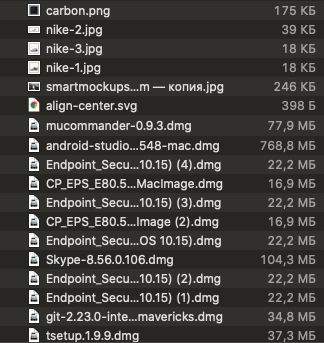
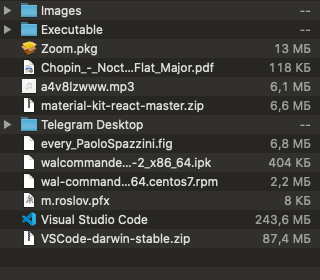

# Clean your downloads folder (Mac/Windows)

## Before 

## After

This program will scan your download folder, if it contains any pictures or executable files, then the program will decompose all non-structured files into folders
